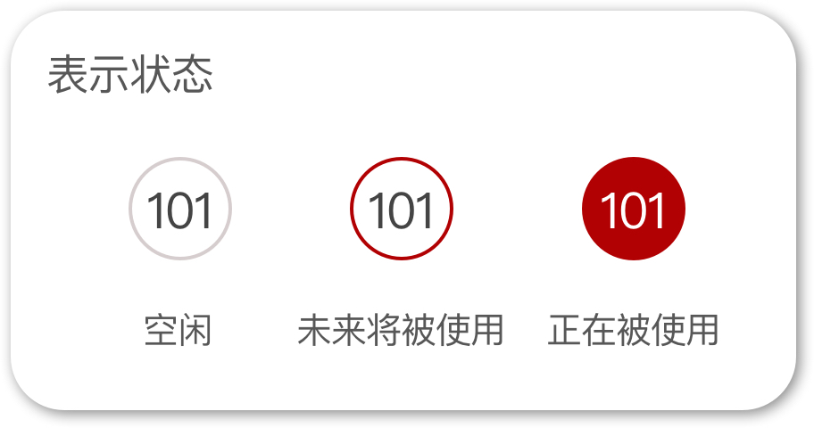
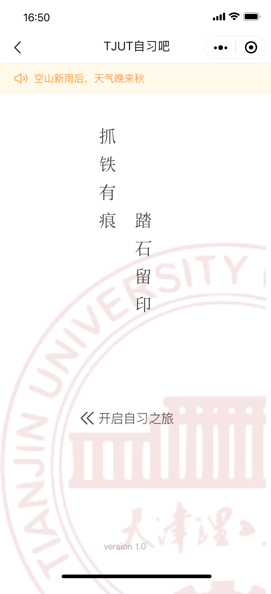
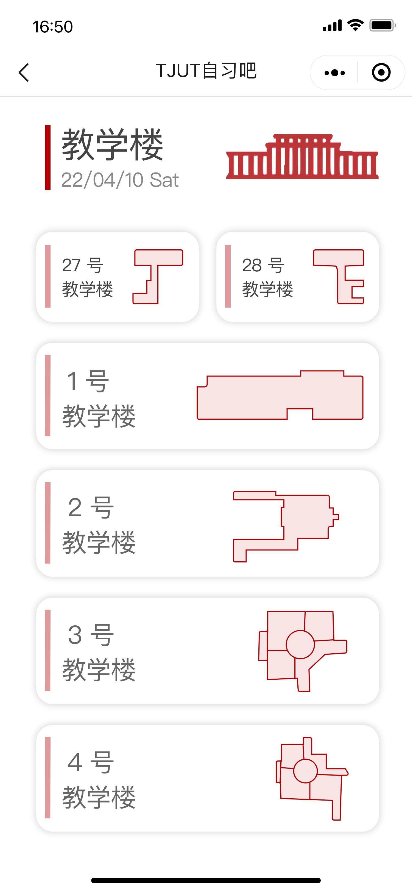
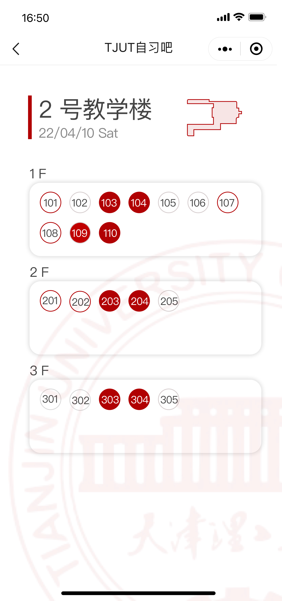
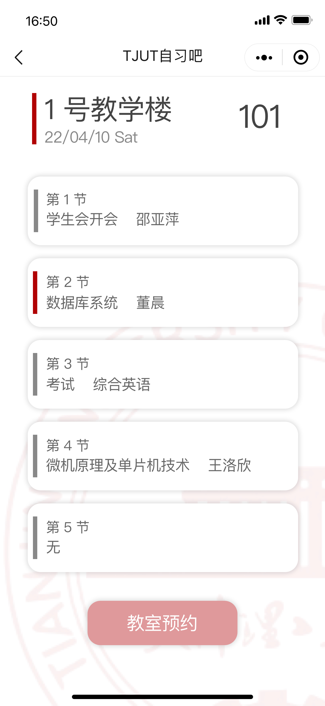
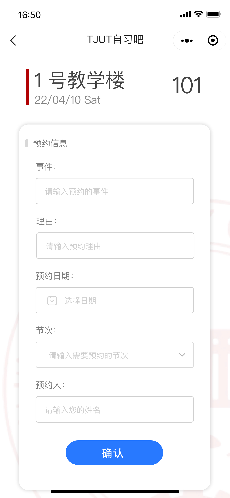
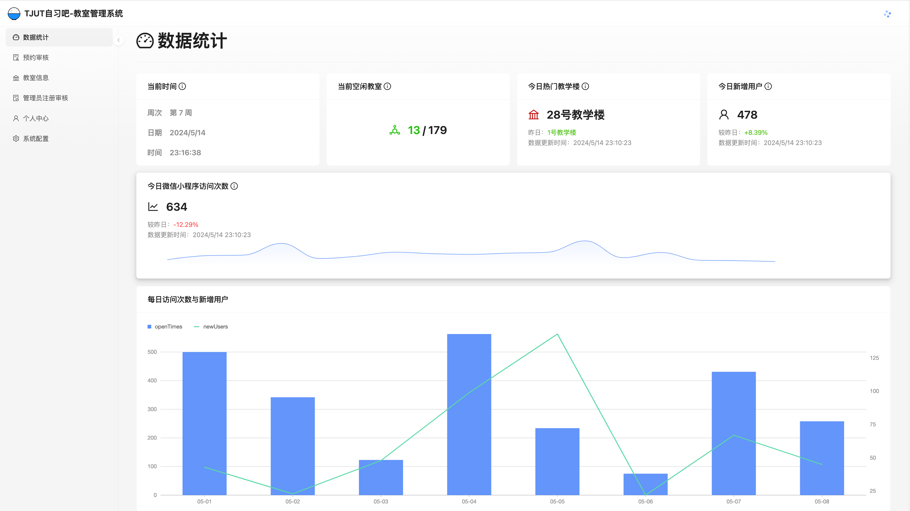
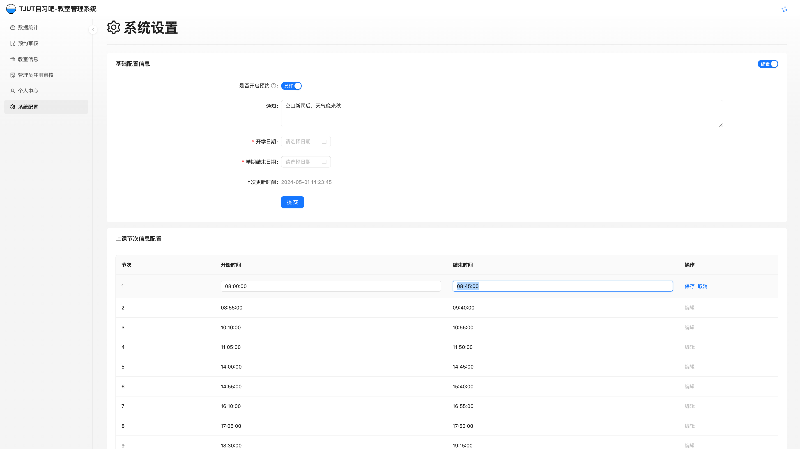
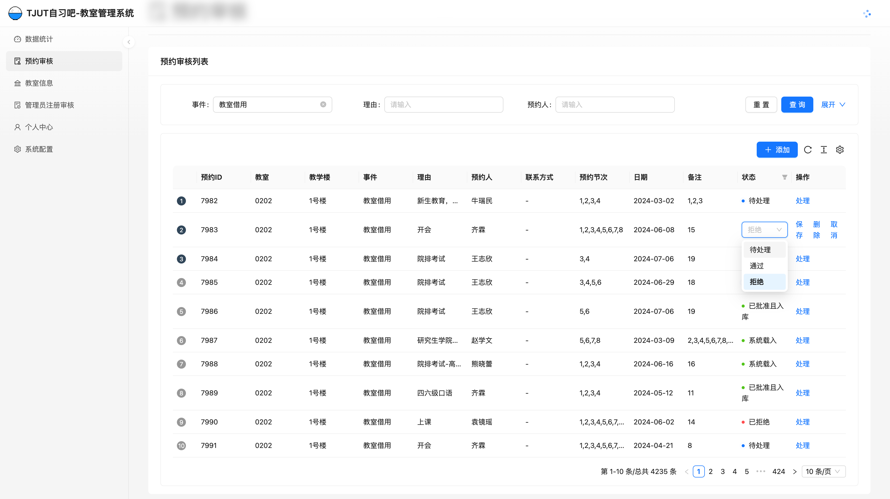
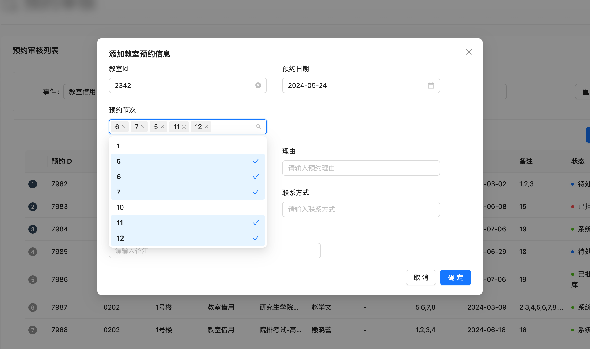

# TJUT自习吧

旨在为同学们提供一个快速查找空闲教室的途径。

## 技术路线

|            | 框架          | 备注        |
| ---------- | ------------- | ----------- |
| 微信小程序 | Uni-APP       | 基于VUE框架 |
| 前端       | React + UmiJS |             |
| 后端       | SpringBoot    |             |
| 爬虫       | BS4           |             |
| 数据库     | MySQL         |             |

## 目录说明

```
tjut_zxb
├─ readme.md // readme
├─ front_end // 前端代码
├─ back_end // 后端代码
├─ wx_mini // 微信小程序端代码
├─ crawler // 爬虫代码
├─ imgs // 图片
└─ database // 数据库文件（只有结构）
```

## 截图

### 微信小程序

#### 状态说明



#### 首页



#### 教学楼选择



#### 教学楼详情



#### 教室详情



#### 预约



## 后天管理-前端









## 爬虫

将课程表HTML解析成JSON文件，然后解析JSON文件，再入库


/毕业项目/tjut_zxb/imgs/Python爬虫添加预约.png)

## 说明

由于后期事件紧迫，代码可能有点点乱，将来可能会将重新整代码再上传